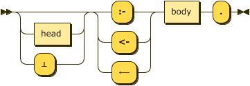
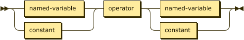
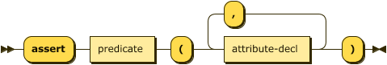
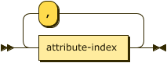

# Concrete Syntax

The definitions below uses both Extended Backus-Naur Form (EBNF)[^ebnf] and 
syntax diagrams[^railroad] to focus on the concrete syntax as expressed in the 
text representation. The EBNF definition is somewhat simplified from the grammar used in the ASDI parser 
although any deviations do not significantly affect the meaning of the language.

## Programs

A program consists of a set of facts that comprise the extensional database, a list of rules that
comprise the intensional database, and possibly a set of queries to interrogate the result of any
reasoning performed over the program.


```ebnf
program ::= pragma* ( fact | rule | query )* ;
```

A program consists of a single file containing facts, rules, and queries as well as any additional
files referenced via _pragmas_.

## Facts

Facts **must** be expressed in the form of ground atoms and so they have a specific rule rather
than a constrained form of the `atom` rule.


```ebnf
fact    ::= predicate ( "(" constant ( "," constant )* ")" )? "." ;
```

A predicate is the identifier shared by a fact and relation.


```ebnf
predicate
        ::= LC_ALPHA ( ALPHA | DIGIT | "_" )* ;
```

**Example** -- the following demonstrates a simple fact denoting that the constant `brooke` representing some
individual is the parent of some individual represented by the constant `"Xerces"`.

```datalog
parent("Xerces", brooke).
```

## Constant Values

Constants are supported in three types, String, Numbers, and Boolean. Whereas some definitions of
Datalog introduce an additional Identifier type, ASDI treats these as _short strings_ that can
safely be expressed without quotes; therefore, the values `xerces` and `"xerces"` are equivalent.


```ebnf
constant
        ::= string | number | boolean ;
```

### Strings

Strings are described in both the identifier and quoted form in the `string` rule.


```ebnf
string  ::= predicate ( ":" ALPHA ( ALPHA | DIGIT | "_" * )? )
            | DQUOTE [^\u{22}]* DQUOTE ;
```

### Numbers

Numeric values in ASDI take one of three forms, integers, decimal values, and floating point values.


```ebnf
number  ::= float | decimal | integer
```

Integer values in ASDI are signed, 64-bit values (`i64`).


```ebnf
integer ::= ( "+" | "-" )? DIGIT+
```

Decimal values in ASDI are ... TBD.


```ebnf
decimal ::= integer "." DIGIT+
```

Floating point values in ASDI are 65-bit IEEE floats (`f64`).


```ebnf
float   ::= decimal ( "e" | "E" ) integer
```

### Booleans

Boolean values may also be represented using `⊤` (down tack `\u{22a4}`) for true, and `⊥` (up tack
`\u{22a5}`) for false where this may improve readability.


```ebnf
boolean ::= ( "true" | "⊤" ) | ( "false" | "⊥" ) ;
```

### Rules

As facts are syntactically distinct from rules in the text representation there is no need for empty
bodies -- all rules **must** have at least one literal. Material implication may be written using
the Unicode character `⟵` (long leftwards arrow`\u{27f5}`).



```ebnf
rule    ::= ( head | "⊥" )? ( ":-" | "<-" | "⟵" ) body "." ;
```

The head of a rule is a disjunction of atoms, or in the case of a constraint the head may is
optional or replaced by the value `"⊥"`.


```ebnf
head    ::= ( atom ( ( ";" | "|" | "OR" | "∨" ) atom )* ) ;
```

The body of a rule is comprised of one, or more, literals.


```ebnf
body    ::= literal ( ( "," | "&" | "AND" | "∧" ) literal )* ;
```

**Example** -- the following sets of rules are equivalent.

```datalog
ancestor(X, Y) :- parent(X, Y).
ancestor(X, Y) <- parent(X, Y).
ancestor(X, Y) ⟵ parent(X, Y).

movie_star(X) :- star(X)  ,  movie_cast_member(X, _, _).
movie_star(X) :- star(X)  &  movie_cast_member(X, _, _).
movie_star(X) :- star(X) AND movie_cast_member(X, _, _).
movie_star(X) :- star(X)  ∧  movie_cast_member(X, _, _).
```

**Example** -- as described in the abstract syntax it is an error to use an extensional relation in the head of
a rule. The following will generate an error:

```datalog
parent("Xerces", brooke).

parent(X,Y) :- father(X,Y).
```

The language feature `disjunction` corresponds to the language $\small\text{Datalog}^{\lor}$ and
allows multiple atoms to appear in the rule's head with the semantics that these are choices. This
syntax will not be accepted unless the feature is enabled.

**Example** -- the following describes the rule that _if X is a parent then X is **either** a
father **or** mother_.

```datalog
.feature(disjunction).

father(X) ;  mother(X) :- parent(X).
father(X) |  mother(X) :- parent(X).
father(X) OR mother(X) :- parent(X).
father(X) ⋁  mother(X) :- parent(X).
```

As the use of disjunction in this position in the head is _inclusive_ it is considered that any rule as above can be transformed
into the following standard form. Clearly, in this case this is not the expected semantics which would require
an exclusive disjunction, the language $\small\text{Datalog}^{\oplus}$. Because the semantics may
cause such confusion ASDI does not do this transformation by default.

```datalog
father(X) :- parent(X).
mother(X) :- parent(X).
```

The language feature `constraints` corresponds to the language $\small\text{Datalog}^{\Leftarrow}$ and
allows the specification of rules with no head. In this case the material implication symbol is
**required**, the falsum value is optional for readability, therefore the following rules are
equivalent.

```datalog
.feature(constraints).

:- alive(X) AND dead(X).
⊥ ⟵ alive(X) ∧ dead(X).
```

### Safety

ASDI will disallow the addition of rules that are unsafe according to the abstract syntax. The
following are examples of unsafe rules:

* `a(X) :- b(Y).` — because `X` appears as a distinguished variable but does not appear in a
  positive relational literal, error
  [`HeadVariablesMissingInBody`](error/enum.Error.html#variant.NegativeVariablesNotAlsoPositive).
* `a(X) :- b(Y), NOT b(X).` — because `X` appears in a negated literal but does not appear in a
  positive relational literal, error
  [`NegativeVariablesNotAlsoPositive`](error/enum.Error.html#variant.NegativeVariablesNotAlsoPositive).
* `a(X) :- b(Y), X < Y.` — Because `X` appears in an arithmetic literal but does not appear in a
  positive relational literal, error
  [`ArithmeticVariablesNotAlsoPositive`](error/enum.Error.html#variant.ArithmeticVariablesNotAlsoPositive).

## Atoms

The text representation of an atom is a relatively simple translation from the abstract syntax
above.


```ebnf
atom    ::= predicate "(" term ( "," term )* ")" ;
```


```ebnf
term    ::= variable | constant ;
```

Note that we explicitly separate variables into named and anonymous forms here.


```ebnf
variable
        ::= named-variable | anon-variable ;
```


```ebnf
named-variable
        ::= UC_ALPHA ( ALPHA | DIGIT | "_" )* ;
        
anon-variable
        ::= "_" ;
```

**Example** -- the following are all valid body atoms.

```datalog
dead(julius_caesar).
emperor(julius_caesar, rome).
emperor(X, Y).
emperor(X, rome).
```

## Literals

Any valid atom is also a valid _positive relational_ literal. The syntax below also allows for _negative_
literals as well as arithmetic expressions as literals. Conjunction may be written with the Unicode
character `∧` (logical and `\u{2227}`).


```ebnf
literal ::= ( "!" | "NOT" | "￢" )? ( atom | comparison ) ;
```

**Example** -- the following rules are all equivalent.

```datalog
ancestor(X, Y) ⟵ parent(X, Z)  ,  ancestor(Z, Y).
ancestor(X, Y) ⟵ parent(X, Z)  &  ancestor(Z, Y).
ancestor(X, Y) ⟵ parent(X, Z)  ∧  ancestor(Z, Y).
ancestor(X, Y) ⟵ parent(X, Z) AND ancestor(Z, Y).
```

The language feature `negation` corresponds to the language $\small\text{Datalog}^{\lnot}$ and
allows the specification of negated literals. Negation may also be written using the Unicode
character `￢` (full-width not sign `\u{ffe2}`). The following rules are equivalent.

```datalog
.feature(negation).

alive(X) :- person(X), NOT dead(X).
alive(X) ⟵ person(X) ∧ ￢dead(X).
```

The following will fail as the negated rule is not considered safe ([Error::NegativeVariablesNotAlsoPositive]).

```datalog
.feature(negation).

alive(X) :- NOT dead(X).
alive(X) ⟵ ￢dead(X).
```

## Arithmetic Literals

The language feature `comparisons` corresponds to the language $\small\text{Datalog}^{\theta}$ and
allows the use of arithmetic literals. Comparisons take place between two literals and are
currently limited to a set of common operators. Note the addition of a string match operator, this
is similar to the Perl `=~` and requires a string value/variable on the left and a string value or
variable on the right that compiles to a valid Rust regular expression. Finally, the rule `named-term`
disallows the use of anonymous variables in arithmetic literals.



```ebnf
comparison
        ::= ( named-variable | constant ) operator ( named-variable | constant ) ;
```


```ebnf
operator
        ::= "="
            | ("!=" | "/=" | "≠")
            | "<"
            | ("<=" | "≤")
            | ">"
            | (">=" | "≥")
            | ("*=" | "≛" | "MATCHES") ;
```

The Unicode characters `≠` (not equal to `\u{2260}`), `≤` (less-than or equal to `\u{2264}`),
`≥` (greater-than or equal to `\u{2265}`, and star equals `\u{e2899b}`) may be substituted for the
common arithmetic and string operators.

All arithmetic operations **must** be between terms of the some type, such that the property
_compatible_ introduce above is defined as:

$$\tag{xvi}\small compatible(\tau_{lhs}, \tau_{rhs}, \theta) \leftarrow \tau_{lhs} = \tau_{rhs}$$

Additionally, some operators are not present for all types, as shown in the table below.

| Type     | `=`, `≠`   | `<`, `≤`, `>`, `≥` | `≛` |
| -------- | ---------- | ------------------ | --- |
| String   | Yes        | Yes - lexical      | Yes |
| Integer  | Yes        | Yes                | No  |
| Boolean  | Yes        | No                 | No  |

**Example** -- the following is an example using arithmetic literals and the _car_ relation.

```datalog
.feature(comparisons).
.assert car(make: string, model: string, age: integer).

antique(X, Y) :- car(X, Y, _) AND X *= "[dD]uesenberg".
antique(X, Y) :- car(X, Y, _) AND Y = "model t".
antique(X, Y) :- car(X, Y, Z) AND Z > 50.
```

## Queries

A query is simply an atom, but one identified to the system as a goal with either the prefix `?-`
or the suffix `?`.


```ebnf
query   ::= ( "?-" atom "." ) | ( atom "?" ) ;
```

**Example** -- the following queries are equivalent and will return the value of the variable `X` for any facts in
the _ancestor_ relationship where the first attribute is the string value `"xerces"`.

```datalog
?- ancestor(xerces, X).
ancestor(xerces, X)?
```

When the value `_` is used in a query it denotes an attribute of the relation that has no meaning
in either the query or the response. For example, in the following query we ask for all values of
the _model_ attribute in the _car_ relation where the _make_ is "ford", and ignore the age entirely.

```datalog
.assert car(make: string, model: string, age: integer).

car("ford", X, _)?
```

The results of this query would not include the age column:

```text
+------------+
| model      |
+============+
| edge       |
+------------+
| escort     |
+------------+
| fiesta     |
+------------+
| focus      |
+------------+
| fusion     |
+------------+
| mustang    |
+------------+
     ...
```

## Pragmas

Pragmas are declarative statements meant for the parser and runtime tooling, they do not affect
the meaning of the program itself.


```ebnf
pragma  ::= "." ( feature | assert | infer | fd | input | output ) "." ;
```

### pragma feature

The `feature` pragma determines which Datalog language is in use. Use of syntax not supported by the
selected language feature will result in errors.


```ebnf
feature ::= "feature" "(" feature-id ( "," feature-id )* ")" ;
```


```ebnf
feature-id
        ::= "comparisons"
        | "constraints"
        | "disjunction"
        | "negation"
        | "functional_dependencies"
```

**Example**

```datalog
.feature(negation).
.feature(comparisons, disjunction).
```

### pragma assert

The `assert` pragma describes a new relation in the extensional database. The parser can determine
the schema for facts from their types in the database. The use of this pragma is therefore optional,
but recommended.



```ebnf
assert  ::= "assert" predicate "(" attribute-decl ( "," attribute-decl )* ")" ;
```


```ebnf
attribute-decl
        ::= ( predicate ":" )? ( "boolean" | "integer" | "string" ) ;
```

**Example**

```datalog
.assert human(name: string).
```

### pragma infer

The `infer` pragma describes a new relation in the intensional database. Typically the parser
can determine the schema for relational literals from their context, The use of this pragma
is therefore optional, but recommended. The alternate form is more explicit in that it defines
an intensional relation in terms of a previously defined extensional relation.


```ebnf
infer   ::= "infer"
            ( predicate "(" attribute-decl ( "," attribute-decl )* ")" )
            | "from" predicate ;
```

**Example**

```datalog
.infer mortal(name: string).
```

Alternatively the short-cut form is often more convenient.

```datalog
.assert human(name: string).
.infer mortal from human.
```

### pragma fd

The `fd` pragma, short for _functional dependency_, introduces a relationship between one or more attributes on the
left-hand (determinant) side and one or more attributes on the right-hand (dependent) side. This relationship denotes
that for a relationship $\small R$ with attributes $\small a_1, \cdots, a_n$, every valid combination of determinant
values uniquely determines the value of the dependent values.

Note that this pragma is only valid if the corresponding language feature is enabled.


```ebnf
fd      ::= ( "fd" | "functional_dependency" ) 
            predicate ":"
            attribute-index-list ( "-->" | "⟶" ) attribute-index-list
``` 



```ebnf
attribute-index-list
        ::= attribute-index ( "," attribute-index )*
```

An attribute index is _either_ an attribute label, if one has been declared for the relation, or an integer $\small i \in \[1,|schema\(R\)|\]$.


```ebnf
attribute-index
        ::= integer | predicate
``` 

**Constraints** -- given the notational form $\small R: \alpha \rightarrow \Beta$;

1. the initial predicate **must** be the label of an extensional relation:
   $$\small R \in D_I \land label\(R\)$$
2. the set of attribute identifiers comprising the set $\small \alpha$ **must** be in $\small R$: 
   $$\small \forall a \in \alpha \(a \in schema\(R\)\)$$
3. the set of attribute identifiers comprising the set $\small \Beta$ **must** be in $\small R$:
   $$\small \forall a \in \Beta \(a \in schema\(R\)\)$$
4. the same attribute identifier **must not** appear in both determinant and dependent:
   $$\small \alpha \cap \Beta = \emptyset$$

**Example** -- given the extensional relation _employee_ the two functional dependencies in the 
following are equivalent. Note that the implementation will ignore such duplicate declarations.

```datalog
.feature(functional_dependencies).
.assert employee(id:integer, name:string).

.fd employee: id --> name.
.fd employee: 1 ⟶ 2.
```

### pragma input

The `input` pragma instructs the parser to load facts for the named extensional relation from an
external file. This pragma **requires** that the relation be previously defined via the `assert`
pragma.


```ebnf
input   ::= "input" io-details "."
```


```ebnf
io-details
        ::= "(" predicate "," quoted-string ( "," quoted-string )? ")" ;
```

**Example**

```datalog
.assert human(name: string).
.input(human, "data/humans.csv", "csv").
```

### pragma output

The `output` pragma instructs the parser to write facts from the named intensional relation to an
external file. This pragma **requires** that the relation be previously defined via the `infer`
pragma.


```ebnf
output  ::= "output" io-details "." ;
```

**Example**

```datalog
.infer mortal(name: string).
.output(mortal, "data/mortals.txt").
```

## Comments

Comments in Datalog are either 1) the `%` character and continue to the end of the line, or
2) C-style with `/*` to start and `*/` to end. These correspond to the same rules as Prolog.


```ebnf
comment ::= "%" [^\r\n]* EOL
            | "/" "*" ( [^\*] | "*"+ [^\*\/] )* "*"+ "/" ;
```

**Example**

```datalog
% Here's a comment
?- ancestor(xerces, X). % and another
?- ancestor(brooke /* and one inline */, X). % and another
```

## Terminal (Lexical) Symbols 

The following are lexical rules that can be assumed by the rules above.

```ebnf
EOL     ::= "\n" | "\r\n" | "\r" ;

WHITESPACE
        ::= " " | "\t" | EOL ;
        
DQUOTE
        ::= '"' ;
        
LC_ALPHA
        ::= ? corresponds to the Unicode category 'Ll' (letter, lower case) ? ;
        
UC_ALPHA
        ::= ? corresponds to the Unicode category 'Lu' (letter, upper case) ? ;
        
ALPHA   ::= LC_ALPHA | UC_ALPHA ;

DIGIT   ::= ? corresponds to the Unicode category 'Nd' (decimal number) ? ;
```

----------

[^ebnf]: For the original description of the EBNF notation as it is used here, please refer to 
   "[A.1.1 Notation](http://www.w3.org/TR/2010/REC-xquery-20101214/#EBNFNotation)" in the 
   [XQuery recommendation](http://www.w3.org/TR/2010/REC-xquery-20101214/). 

[^railroad]: The syntax, or _railroad_, diagrams were generated by the [bottlecaps](https://www.bottlecaps.de/rr/ui) online tool from the definition in the [appendix](../reference/datalog_ebnf.md).

