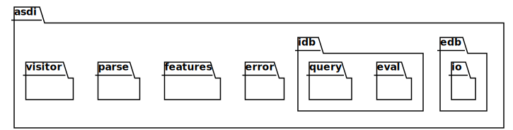

# Model API

This chapter will walk through various parts of the ASDI crate, not as an API reference, which is to be found in
the [rust doc](https://docs.rs/asdi/latest/asdi/), but at a higher level and so some specific details not be
covered here.

The following is a representation of the module structure, note that this isn't quite the same as the book 
organization shown on the left.

3.1: crate module structure.

