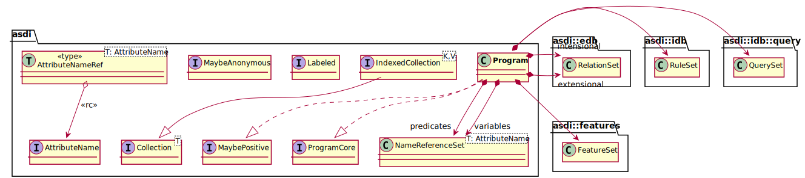

# Programs

A `Program` is the key entry point in the crate, and it is provided in the crate's root. The following diagram shows 
the content of the root, with the program class in bold. As you can see the program class is an aggregate of other
classes in modules `edb`, `features`, `idb`, and `idb::query`.

3.2: library top level

## Traits

The crate root also includes a number of common traits. In the following diagram the details of these traits are
shown, eliding a number of the classes from the figure above.

3.3: common traits, expanded

## Program

The following is an expanded view of the Program struct from figure 3.2. Note that, in this diagram, the fill color 
for some classes was set to white. This is to indicate that while they are still important they are of secondary 
importance to the current discussion.

3.4: Program, expanded

