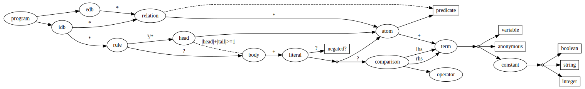

# Appendix: Abstract Graphical View

The following graph is an alternative representation of the [abstract syntax](../datalog/abstract.md). It represents 
_leaf values_ (constants, variables, ...) in rectangles and _composite values_ as ellipses. Additionally, where a 
composite is defined as $\small A \oplus B$ a small filled diamond shape represents the exclusive or relationship.
Finally, some edges in the graph are labeled with "`*`", "`+`", and "`?`" which are the common cardinality notation used
in regular expressions and BNF notation. 



1. The edge between _rule_ and _head_ has the label "`?/*`" as it has differing cardinality under $\small\text{Datalog}$, 
   $\small\text{Datalog}^{\lor}$, and $\small\text{Datalog}^{\bot}$. 
2. The edge between _literal_ and _negated?_ is labeled as "`?`" as it is necessary under $\small\text{Datalog}^{\lnot}$
   but not under $\small\text{Datalog}$.
3. The edge from the choice between _literal_ and _comparison_ is labeled as "`?`" as it is necessary under
   $\small\text{Datalog}^{\theta}$ but not under $\small\text{Datalog}$.
4. The two dashed lines represent the following constraints.
   1. Between _relation_ and _predicate_ to represent the fact that the predicate for a relation may be derived from the
      predicate of the _atoms_ within it (or vice versa).
   2. Between _head_ and _body_ to represent the fact that while both are optional for a _rule_, one or other must be 
      present.

## GraphViz Source

The following is the source for the graph above.

```dot
{{#include abstract_graph.dot}}
```

This file is accessible directly [here](abstract_graph.dot).